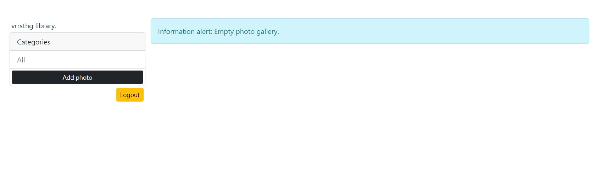

# django_photoshare_app
Own photo gallery with user authentication

    Login/Register page


    Main page
if empty gallery

if add photo and categories


    Add photo


    View photo


    Sort by category


 Installation packages in you own venv
```sh
pip install django
pip install psycopg2
pip install Pillow
```

'cd photoshare' and run server
```sh
python manage.py runserver
```